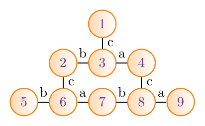

# The Magic Triangle

This project presents a simple solver (brute-force) for an old puzzle
published by [Heye puzzle], which I recently came across. Apparently,
the game is available in different flavors ([triangles][1],
[squares][2]).

The version of puzzle used here consists of nine equilateral triangles
with lower and upper parts of figures printed on them. The objective is
to form a large triangle in such a way that the shapes and colors of the
parts of the figures on neighbouring triangles match.

# Approach

The following triangles come with the game (cf. the image above):

| Triangle  |  a  |  b  |  c  |
|----------:|-----|-----|-----|
|         1 |  HO |  BW |  HW |
|         2 |  HG |  BG |  HW |
|         3 |  BG |  HG |  HO |
|         4 |  HO |  BG |  BW |
|         5 |  BO |  BG |  HO |
|         6 |  BO |  HO |  BG |
|         7 |  HG |  BG |  HO |
|         8 |  BW |  BG |  HW |
|         9 |  HO |  BW |  BO |

where the following notations is used:

* HO -- head orange
* HG -- head green
* HW -- head white
* BO -- body orange
* BG -- body green
* BW -- body white

The solver will use a brute-force approach, i.e. it will try and test
all possible combinations in order to find the solution. So, given nine
triangles, a total of 362880 permutations exist to form a large
triangle. For each of these (spatial) permutations, every triangle can
be rotated in one of three ways (0, 120, 240 degrees), which amounts to
19683 possible combinations. That means, approximately 7.1e9 different
configurations will have to be evaluated.

For each of the configurations above, nine pairs of neighboring
triangles are tested. These pairs are represented by edges connecting
the nodes in the above figure. The labels on the edges denote the sides
of neighboring triangles (`a`, `b`, `c`) that need to be tested. A test
is valid if one of the neighboring triangle has a head of figure printed
on it while a body printed on the other triangle and both are of the
same color.

# Usage

Just run

	$ python ./the-magic-triangle.py

and wait (it took ~12h on my computer).

The solutions will be stored into text files of the form
`p119410_r11467.txt`, where the first part denotes the `p`-th
permutation and the second part denotes the `r`-th configuration of the
rotations. Inside the file will be an ASCII representation of the
solution, e.g.

	          /2\ 
	         /   \ 
	        /     \ 
	        -------
	      /9\     /1\ 
	     /   \   /   \ 
	    /     \7/     \ 
	    ------- -------
	  /3\     /8\     /6\ 
	 /   \   /   \   /   \ 
	/     \5/     \4/     \  (<- not a solution)
	------- ------- -------

----

For the impatient, the solutions can be found [here](doc/solutions.txt).

[1]: http://www.google.de/search?q=heye+magische+dreieck&prmd=ivns&source=lnms&tbm=isch
[2]: http://heye-puzzle.de/kategorie/crazy-9/
[Heye puzzle]: http://heye-puzzle.de
