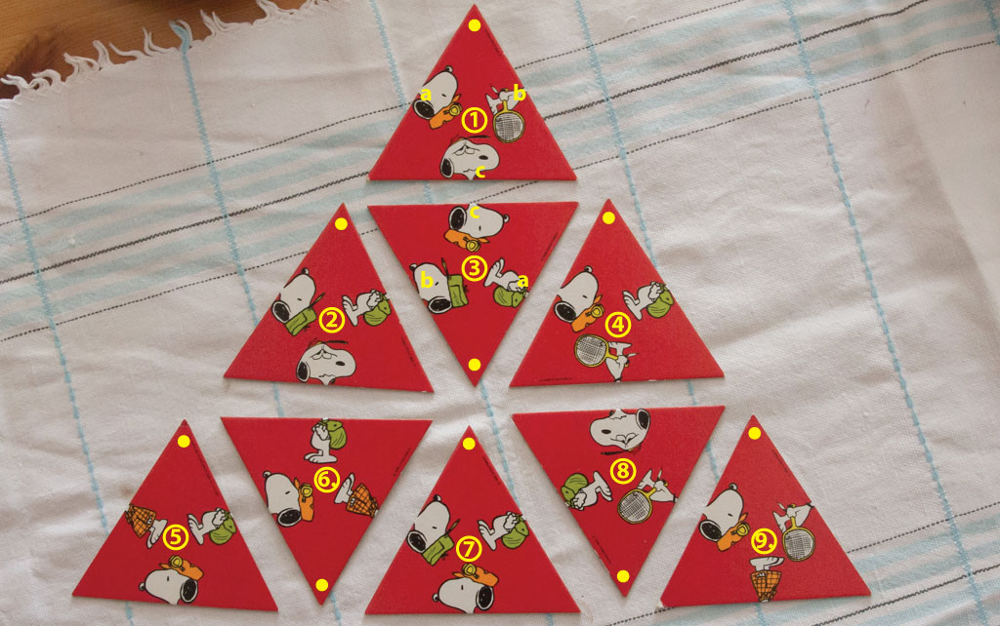

# The Magic Triangle

This project presents a simple solver for an old puzzle published by
[Heye puzzle], which I recently came across. Apparently, the game is
available in different flavors ([triangles][1], [squares][2]).

The version of puzzle used here consists of nine equilateral triangles
with lower and upper parts of figures printed on them. The objective is
to form a large triangle in such a way that the shapes and colors of the
parts of the figures on neighbouring triangles match.

# Approach

The following triangles come with the game (cf. the image above):

| Triangle  |  a  |  b  |  c  |
|----------:|-----|-----|-----|
|         0 |  HO |  BW |  HW |
|         1 |  HG |  BG |  HW |
|         2 |  BG |  HG |  HO |
|         3 |  HO |  BG |  BW |
|         4 |  BO |  BG |  HO |
|         5 |  BO |  HO |  BG |
|         6 |  HG |  BG |  HO |
|         7 |  BW |  BG |  HW |
|         8 |  HO |  BW |  BO |

where

* HO -- head orange
* HG -- head green
* HW -- head white
* BO -- body orange
* BG -- body green
* BW -- body white

The triangles are indexed as shown below:

	                / \    
	               /   \   
	              /0a 0b\  
	             /   0   \ 
	            /    0c   \ 
	            ----------- 
	          / \    1c   / \     
	         /   \   7   /   \    
	        /2a 2b\1b 1a/8b 8a\   
	       /   8   \   /   1   \ 
	      /    2c   \ /    8c   \ 
	      ----------- ----------- 
	    / \    3c   / \    6c   / \     
	   /   \   4   /   \   3   /   \    
	  /4a 4b\3b 3a/5a 5b\6b 6a/7a 7b\   
	 /   2   \   /   6   \   /   5   \ 
	/    4c   \ /    5c   \ /    7c   \ 
	----------- ----------- ----------- 

The solver uses [backtracking][3] in order to find the solutions. Given
a set containing nine triangles, a total of 362880 permutations exist to
form a large triangle. For each of these (spatial) permutations, every
triangle can be rotated in one of three ways (0, 120, 240 degrees),
which amounts to 19683 possible combinations. That means, all in all
approximately 7.1e9 different possible configurations exist.
Backtracking helps to discard most of these (possible but wrong)
configurations.

When evaluating one of the configurations above, nine pairs of
neighboring triangles are tested. A test is valid if one of the
neighboring triangle has a head of figure printed on it while a body
printed on the other triangle and both are of the same color.

According to the publisher of the game, two solutions exist. The solver
will find six solutions, though. That is because each of the two
solutions can be rotated into three different position.

# Usage

Just run

	$ python ./the_magic_triangle.py

----

For the impatient, the solutions can also be found [here](doc/solutions.txt).

[1]: http://www.google.de/search?q=heye+magische+dreieck&prmd=ivns&source=lnms&tbm=isch
[2]: http://heye-puzzle.de/kategorie/crazy-9/
[3]: https://en.wikipedia.org/wiki/Backtracking
[Heye puzzle]: http://heye-puzzle.de
